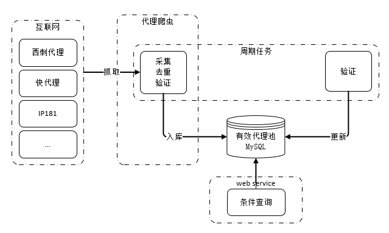

# Golang实现的IP代理池

> 采集免费的代理资源为爬虫提供有效的IP代理

## 系统功能

- 自动爬取互联网上公开的免费代理IP
- 周期性验证代理IP有效性
- 提供http接口获取可用IP

## 系统架构



## 代理池设计

代理池由四部分组成：

- Fetcher：

代理获取接口，目前有几个 **免费代理源** ，每调用一次就会抓取这些网站最新的代理放入Channel，可自行 **添加额外的代理获取接口** 

- Channel：

临时存放采集来的代理，通过访问稳定的网站去验证代理的有效性，有效则存入数据库

- Schedule：

用定时的计划任务去检测数据库中代理IP的可用性，删除不可用的代理。同时也会主动通过 Fetcher 去获取最新代理

- Api：

代理池的访问接口，提供 `get` 接口输出 `JSON` ，方便爬虫直接使用

## 目前支持的代理

代理获取接口，目前抓取这几个网站的 **免费代理** ，当然也支持自己扩展代理接口；

- [89免费代理](https://www.89ip.cn)
- [66免费代理网](http://www.66ip.cn)
- [云代理](http://www.ip3366.net)
- [快代理](http://www.kuaidaili.com)
- [Proxylist+](https://list.proxylistplus.com)

## 安装及使用

### 源码安装

```shell
# 克隆项目
git clone https://github.com/wuchunfu/IpProxyPool.git

# 切换项目目录
cd IpProxyPool

# 修改数据库信息
vi conf/config.yaml

host: 127.0.0.1
dbName: IpProxyPool
username: IpProxyPool
password: IpProxyPool

# 执行 sql 脚本，创建数据库表
source docs/db/mysql.sql

# 安装go依赖包
go list (go mod tidy)

# 编译
go build IpProxyPool.go

# 赋予可执行权限
chmod +x IpProxyPool

# 运行
./IpProxyPool proxy-pool
```

### Docker 安装

> `Docker` 请自行安装，安装完 `docker` 后查看是否安装 `docker-compose`
> 执行这个命令查看是否成功安装 `docker-compose`, `docker-compose -version`

```shell
# 克隆项目
git clone https://github.com/wuchunfu/IpProxyPool.git

# 进入项目目录
cd IpProxyPool

# 执行以下命令启动
docker-compose -f docker-compose.yaml up -d

# 执行以下命令停止
docker-compose -f docker-compose.yaml down
```

## 访问

```shell
# web 访问
http://127.0.0.1:3000

# or
# 随机输出可用的代理
curl http://127.0.0.1:3000/all

# 随机输出HTTP代理
curl http://127.0.0.1:3000/http

# 随机输出HTTPS代理
curl http://127.0.0.1:3000/https
```

## 计划任务

- [ ] [西拉免费代理IP](http://www.xiladaili.com)
- [ ] [站大爷](https://www.zdaye.com)

## 诚挚的感谢

- 首先感谢您的使用，如果觉得程序还不错也能帮助您解决实际问题，不妨添个赞以鼓励本人继续努力，谢谢！
- 如果您对程序有任何建议和意见，也欢迎提交issue。
- 当然，如果您愿意贡献代码和我一起改进本程序，那再好不过了。

## 注意
本代码库仅用于学习研究使用，请勿用于非法用途，本人不承担由此带来的任何法律问题。

## 交流

欢迎关注 **全栈公园** ，有什么问题可以在 **全栈公园** 公众号输入 **开源交流** 进行咨询


